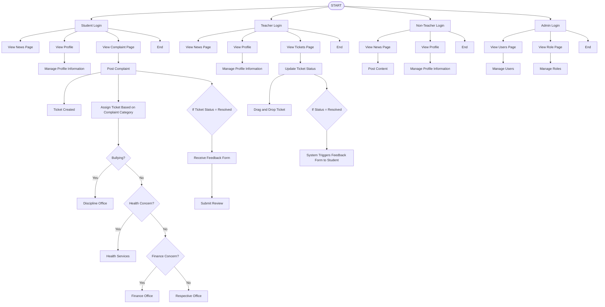

# ACCOUNT DEMO

| Role        | Description                               | Email                                                                                                 |
| ----------- | ----------------------------------------- | ----------------------------------------------------------------------------------------------------- |
| Admin       | Admin account for managing website        | [heralatrina+admin@gmail.com](mailto:heralatrina+admin@gmail.com)                                     |
| Student     | Student                                   | [heralatrina+student_regular@gmail.com](mailto:heralatrina+student_regular@gmail.com)                 |
| Student     | Student account for Student Affair Office | [heralatrina+student_student_affairs@gmail.com](mailto:heralatrina+student_student_affairs@gmail.com) |
| Teacher     | Teacher account for Guidance Office       | [heralatrina+teacher_guidance@gmail.com](mailto:heralatrina+teacher_guidance@gmail.com)               |
| Teacher     | Teacher account for Health Services       | [heralatrina+teacher_health_services@gmail.com](mailto:heralatrina+teacher_health_services@gmail.com) |
| Teacher     | Teacher account for Security              | [heralatrina+teacher_security@gmail.com](mailto:heralatrina+teacher_security@gmail.com)               |
| Teacher     | Teacher account for Discipline            | [heralatrina+teacher_discipline@gmail.com](mailto:heralatrina+teacher_discipline@gmail.com)           |
| Teacher     | Teacher account for Finance               | [heralatrina+teacher_finance@gmail.com](mailto:heralatrina+teacher_finance@gmail.com)                 |
| Teacher     | Teacher account for Administrative        | [heralatrina+teacher_administrative@gmail.com](mailto:heralatrina+teacher_administrative@gmail.com)   |
| Non-Teacher | Account used for posting on news page     | [heralatrina+nonteacher@gmail.com](mailto:heralatrina+nonteacher@gmail.com)                           |

# Project Flow Chart

